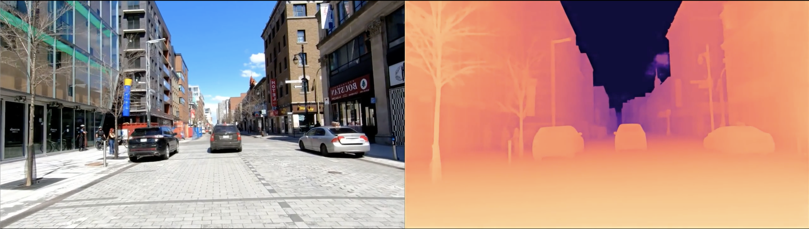

<div align="center">
<h1>ECoDepth: Effective Conditioning of Diffusion Models for Monocular Depth Estimation</h1>

**CVPR 2024**  
<a href='https://ecodepth-iitd.github.io' style="margin-right: 20px;"></a>
<a href="https://arxiv.org/abs/2403.18807" style="margin-right: 20px;"></a>
<a href="https://arxiv.org/abs/2403.18807" style="margin-right: 20px;"></a>
<a href="https://arxiv.org/abs/2403.18807" style="margin-right: 20px;"></a>

[Suraj Patni](https://github.com/surajiitd)\*,
[Aradhye Agarwal](https://github.com/Aradhye2002)\*,
[Chetan Arora](https://www.cse.iitd.ac.in/~chetan)<br/>

</div>




## News
- **[April 2024] Inference scripts for video or image to depth.**
- [March 2024] Pretrained checkpoints for NYUv2 and KITTI datasets.
- [March 2024] Training and Evaluation code released!
- [Feb 2024] ECoDepth accepted in CVPR'2024.


## Installation

``` bash
git clone https://github.com/Aradhye2002/EcoDepth
cd EcoDepth
conda env create -f env.yml
conda activate ecodepth
```
## Dataset Setup
You can take a look at the dataset preparation guide for NYUv2 and KITTI from [here](https://github.com/cleinc/bts). After downloading the datasets, change the data paths in the respective bash files to point to your dataset location where you have downloaded the datasets. Alternatively, you can also make a symbolic link of the dataset folders like so:
``` bash
cd depth
mkdir data
cd data
ln -s <path_to_kitti_dataset> kitti
ln -s <path_to_nyu_dataset> nyu
```
Note the dataset structure inside the path you have given in the bash files should look like this:  
**NYUv2**: 
``` bash
nyu
├── nyu_depth_v2
│   ├── official_splits
│   └── sync
```
**KITTI**: 
``` bash
kitti
├── KITTI
│   ├── 2011_09_26
│   ├── 2011_09_28
│   ├── 2011_09_29
│   ├── 2011_09_30
│   └── 2011_10_03
└── kitti_gt
    ├── 2011_09_26
    ├── 2011_09_28
    ├── 2011_09_29
    ├── 2011_09_30
    └── 2011_10_03
```

## Pretrained Models

Please download the pretrained weights from [this link](https://drive.google.com/drive/folders/1BVWLrdHw0bfsuzzL62S7xpWmmqgvysxd?usp=sharing) and save `.ckpt` weights inside `<repo root>/depth/checkpoints` directory.

Also download the v1-5 checkpoint of [stable-diffusion](https://huggingface.co/stable-diffusion-v1-5/stable-diffusion-v1-5/blob/main/v1-5-pruned-emaonly.ckpt) and put it in the `<repo root>/checkpoints` directory. Please create an empty directory if you find that such a path does not exist. Note that this checkpoints folder is different from the one above. 

## Inference

To perform inference on any RGB image or video use the `infer_{outdoor,indoor}.sh` file. Set the `--img_path` argument to the image you would to get the depth for and the `--video_path` to the video from which to produce the depth. In case you only wish to infer on an img or video, simply remove the other argument. Then enter the `depth` directory by executing `cd depth` and run:

1. **Infer on outdoor scenes**:
`bash infer_outdoor.sh`

2. **Infer on outdoor scenes**:
`bash infer_indoor.sh`

## Evaluation
To evaluate the model performance on NYUv2 and KITTI datasets, use the `test_{kitti, nyu}` file. The trained models are publicly available, download the models using [above links](#pretrained-models). Then, navigate to the `depth` directory and follow the instructions outlined below:

1. **Evaluate on NYUv2 dataset**:  
`bash test_nyu.sh <path_to_saved_model_of_NYU>`  

2. **Evaluate on KITTI dataset**:  
`bash test_kitti.sh <path_to_saved_model_of_KITTI>`

## Training 
We trained our models on 32 batch size using 8xNVIDIA A100 GPUs. Inside the `train_{kitti,nyu}.sh` set the `NPROC_PER_NODE` variable and `--batch_size` argument to the desired values as per your system resources. For our method we set them as `NPROC_PER_NODE=8` and `--batch_size=4` (resulting in a total batch size of 32). Afterwards, navigate to the `depth` directory by executing `cd depth` and follow the instructions:

1. **Train on NYUv2 dataset**:  
`bash train_nyu.sh`  

1. **Train on KITTI dataset**:  
`bash train_kitti.sh`

### Contact
If you have any questions about our code or paper, kindly raise an issue on this repository.

### Acknowledgment
We thank [Kartik Anand](https://github.com/k-styles) for assistance with the experiments. 
Our source code is inspired from [VPD](https://github.com/wl-zhao/VPD) and [PixelFormer](https://github.com/ashutosh1807/PixelFormer). We thank their authors for publicly releasing the code.

### BibTeX (Citation)
If you find our work useful in your research, please consider citing using:
``` bibtex
@InProceedings{Patni_2024_CVPR,
    author    = {Patni, Suraj and Agarwal, Aradhye and Arora, Chetan},
    title     = {ECoDepth: Effective Conditioning of Diffusion Models for Monocular Depth Estimation},
    booktitle = {Proceedings of the IEEE/CVF Conference on Computer Vision and Pattern Recognition (CVPR)},
    month     = {June},
    year      = {2024},
    pages     = {28285-28295}
}
```
