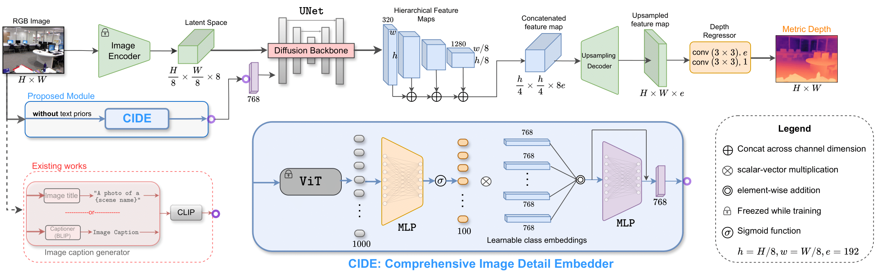

<div align="center">
<h1>ECoDepth: Effective Conditioning of Diffusion Models for Monocular Depth Estimation</h1>

**CVPR 2024**  
<a href='https://ecodepth-iitd.github.io' style="margin-right: 20px;"></a>
<a href="https://arxiv.org/abs/2403.18807" style="margin-right: 20px;"></a>
<a href="https://arxiv.org/abs/2403.18807" style="margin-right: 20px;"></a>
<a href="https://arxiv.org/abs/2403.18807" style="margin-right: 20px;"></a>

[Suraj Patni](https://github.com/surajiitd)\*,
[Aradhye Agarwal](https://github.com/Aradhye2002)\*,
[Chetan Arora](https://www.cse.iitd.ac.in/~chetan)<br/>

</div>





## News
- `Coming soon` Inference script for a single RGB image.
- `Coming soon` Pretrained checkpoints for NYUv2 and KITTI datasets.
- `March 2024` Training and Evaluation code released!
- `Feb 2024` ECoDepth accepted in CVPR'2024.


## Installation

``` bash
git clone https://github.com/Aradhye2002/EcoDepth
cd EcoDepth
conda env create -f env.yml
conda activate ecodepth
```
## Dataset Setup
You can see the dataset preparation guide for NYUv2 and KITTI from [here](https://github.com/cleinc/bts). After downloading the datasets change the paths in the desired bash scripts for evaluation and training, or you can also make a symbolic link of the dataset folders like this.
``` bash
cd depth; mkdir data;cd data
ln -s <path_to_kitti_dataset> kitti
ln -s <path_to_nyu_dataset> nyu
```
Note the dataset structure inside the path you have given in bash files should look like this:  
**NYUv2**: 
``` bash
nyu
├── nyu_depth_v2
│   ├── official_splits
│   └── sync
```
**KITTI**: 
``` bash
kitti
├── KITTI
│   ├── 2011_09_26
│   ├── 2011_09_28
│   ├── 2011_09_29
│   ├── 2011_09_30
│   └── 2011_10_03
└── kitti_gt
    ├── 2011_09_26
    ├── 2011_09_28
    ├── 2011_09_29
    ├── 2011_09_30
    └── 2011_10_03
```

## Pretrained Models

Please download the pretrained weights from [this link]() and save `.ckpt` weights inside `<repo root>/depth/checkpoints` directory.

## Evaluation
To evaluate our performance on NYUv2 and KITTI datasets, use `test.py` file. The trained models are publicly available, download the models using [above links](#pretrained-models). then navigate to the `depth` directory by executing `cd depth` and follow the instructions outlined below:

1. **Evaluate on NYUv2 dataset**:  
`bash test_nyu.sh <path_to_saved_model_of_NYU>`  

2. **Evaluate on KITTI dataset**:  
`bash test_kitti.sh <path_to_saved_model_of_KITTI>`

## Training 
We trained our models on 32 batch size using 8xNVIDIA A100 GPUs. Inside the `train_*.sh` set the `NPROC_PER_NODE` variable and `--batch_size` argument to set the batch size. We set them as `NPROC_PER_NODE=8` and `--batch_size=4`. So our effective batch_size is 32. then navigate to the `depth` directory by executing `cd depth` and follow the instructions outlined below:

1. **Train on NYUv2 dataset**:  
`bash train_nyu.sh`  

1. **Train on KITTI dataset**:  
`bash train_kitti.sh`

### Contact
If you have any questions about our code or paper, kindly raise an issue on Github.

### Acknowledgment
We thank [Kartik Anand](https://github.com/k-styles) for assistance with the experiments. 
Our source code is inspired from [VPD](https://github.com/wl-zhao/VPD) and [PixelFormer](https://github.com/ashutosh1807/PixelFormer), we thank their authors for publicly releasing the code.

### BibTeX (Citation)
If you find our work useful in your research, please consider citing using:
``` bibtex
@article{patni2024ecodepth,
  title={ECoDepth: Effective Conditioning of Diffusion Models for Monocular Depth Estimation},
  author={Patni, Suraj and Agarwal, Aradhye and Arora, Chetan},
  journal={arXiv preprint arXiv:2403.18807},
  year={2024}
}
```
